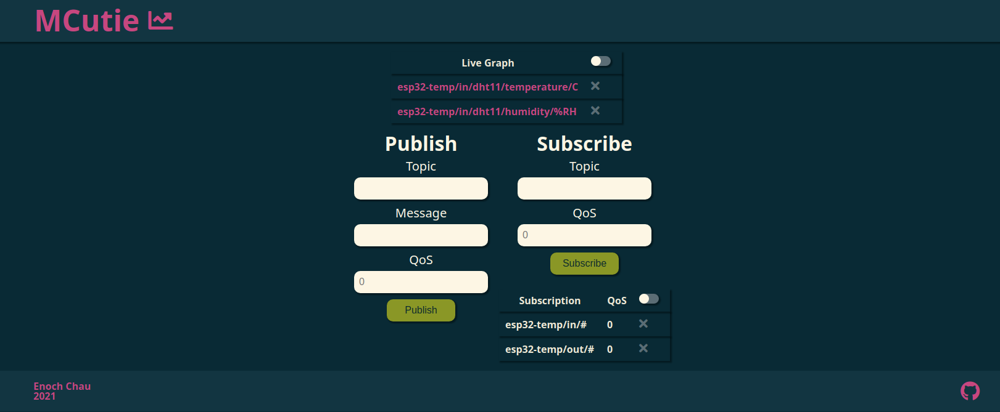
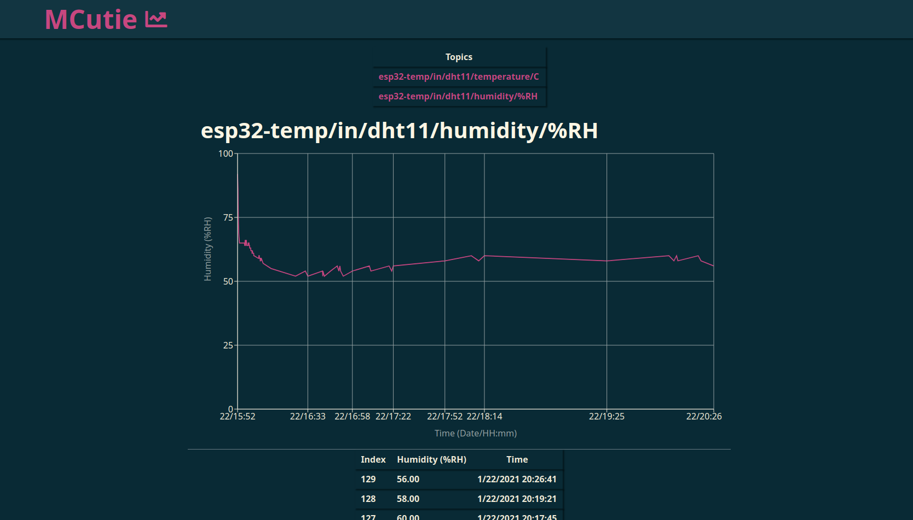

- [MQTT Server API and Client](#mqtt-server-api-and-client)
  * [Deploying on a Raspberry Pi](#deploying-on-a-raspberry-pi)
- [Frontend Client](#frontend-client)
  * [Using .env](#using-env)
  * [Using `client/src/util.js`](#using--client-src-utiljs-)
  * [Changing Colors](#changing-colors)
- [Backend Server](#backend-server)
  * [Using .env](#using-env-1)
- [Server API Reference](#server-api-reference)
  * [`GET`](#-get-)
    + [`/mqtt/t`](#--mqtt-t-)
    + [`/mqtt/s`](#--mqtt-s-)
    + [`/mqtt/m?topic=<MQTT TOPIC>`](#--mqtt-m-topic--mqtt-topic--)
  * [`POST`](#-post-)
    + [`/mqtt/s`](#--mqtt-s--1)
  * [`DELETE`](#-delete-)
    + [`/mqtt/t`](#--mqtt-t--1)
    + [`/mqtt/s`](#--mqtt-s--2)
- [Web Socket Reference](#web-socket-reference)
  * [Live Data](#live-data)
  * [Websocket Requests and Responses](#websocket-requests-and-responses)
    + [Client wants to publish data](#client-wants-to-publish-data)
    + [Client requests data fro a live topic](#client-requests-data-fro-a-live-topic)
    + [Server wants to update the clients topic list](#server-wants-to-update-the-clients-topic-list)

# MCutie: MQTT Server Logger and Client
MCutie provides a web client and API to log and chart MQTT sensor data.
MCutie should run concurrently with an MQTT broker such as mosquitto.

## Deploying on a Raspberry Pi
1. Allow the port for the client: `sudo ufw allow 80`.
2. Allow the port for the server: `sudo ufw allow 5000`.
3. Set up the MQTT broker `sudo apt install mosquitto`.
    * You should [enable passwords and users](https://www.digitalocean.com/community/tutorials/how-to-install-and-secure-the-mosquitto-mqtt-messaging-broker-on-ubuntu-16-04).
4. Change `./backend/.env` to reflect the credentials of the broker.
5. Install sqlite3: `sudo apt-get install sqlite3`.
5. Change `./client/src/util.js` to reflect credentials of the Raspberry Pi.
6. Rebuild the client: `cd client` then `npm run build`.
7. Launch the App from the root directory with `npm run prod`.
8. You should be able to see the App running on the local network from the IP address of your Raspberry Pi.

# Frontend Client
* React.js

## Using .env
A sample .env file has been included in the `client/` folder.
* `PORT`: port to run the client server on. The default port for `HTTP` is 80.
* `IPADDRESS`: Ip address of the device running the server. You can get this on Linux using `ifconfig` and Windows using `ipconfig`.

## Using `client/src/util.js`
The variables defined in `util.js` should match those used by the backend server.
The only variables you should change are `const IPADDRESS` and `const PORT`.
* `const IPADDRESS`: This should match the Ip address of the device running the backend server.
* `const PORT`: This should match the port of the backend server.


## Changing Colors
Most components are colored by `src/css/stylesheet.css`. 
Chart colors are defined in `src/util.js`. 
You can use another [base16](https://github.com/chriskempson/base16) color scheme or change the color codes to your liking. 
The default color scheme is based on [Solarized Dark](https://en.wikipedia.org/wiki/Solarized_(color_scheme)).



# Backend Server
* SQlite3
* Express.js

The server is an MQTT client. The server listens on subscribed topics and records those messages to an SQLite3 database.

The server also manages a REST API to view logged MQTT msgs and can update subscriptions.

For `POST` and `DELETE` requests, use the x-www-form-urlencoded content policy.

## Using .env
A sample .env file has been included in the `backend/` folder.
* `DB_HOST`: database host, the intended database is sqlite3 
* `MQTT_BROKER`: mqtt broker, this app is intended to be run on the same machine as your broker.
* `MQTT_CLIENTID`: mqtt client id, pick something unique
* `MQTT_USERNAME/MQTT_PASSWORD`: if you have certification set up on your mqtt broker, put your username/password here.
* `MQTT_FLOAT_RES`: For floating point incoming data, checks the data against the rule: (PreviousData - CurrentData > FloatResoltuion) ? addToDataBase : dontAddToDataBase
* `MQTT_INT_RES`: For integer incoming data, checks the data against the rule: (PreviousData - CurrentData > IntResoltuion) ? addToDataBase : dontAddToDataBase
* `LOGLEVEL`: log level, most stuff is on debug, anything breaking will be on info and below.
* `PORT`: port to run the backend server on. This should align with the port listed in `client/src/util.js`.
* `IPADDRESS`: Ip address of the device running the server. You can get this on Linux using `ifconfig` and Windows using `ipconfig`.

# Server API Reference
## `GET`
### `/mqtt/t`
Returns mqtt topics.
* 200: Ok
* 500: Error getting data from database.
```json
[
    {
        "topic": "hi"
    }
]
```

### `/mqtt/s`
Returns subscribed topics.
* 200: Ok
* 500: Error getting data from database.
```json
[
    {
        "id": 2,
        "topic": "hi",
        "qos": 0,
        "createdAt": "2021-01-21T11:03:45.677Z"
    },
    {
        "id": 3,
        "topic": "hi2",
        "qos": 0,
        "createdAt": "2021-01-21T11:03:48.352Z"
    }
]
```

### `/mqtt/m?topic=<MQTT TOPIC>`
Returns messages for the given query topic.
For example, to query for `hi`, use the url ```http://localhost:5000/mqtt/m?topic=hi```.
* 200: Ok
* 500: Error getting data from database.

```json
[
    {
        "id": 1,
        "message": "hi",
        "topic": "hi",
        "createdAt": "2021-01-21T10:57:56.379Z"
    },
    {
        "id": 2,
        "message": "hi",
        "topic": "hi",
        "createdAt": "2021-01-21T10:57:57.266Z"
    },
    {
        "id": 3,
        "message": "hi",
        "topic": "hi",
        "createdAt": "2021-01-21T10:57:58.214Z"
    },
    {
        "id": 4,
        "message": "hi",
        "topic": "hi",
        "createdAt": "2021-01-21T11:03:50.375Z"
    }
]
```

## `POST`

### `/mqtt/s`
Subscribe to a new topic.
* 400: bad payload
* 400: subscription already exists
* 502: mqtt client failed to subscribe
* 500: failed to add data to database
Request body should be in the format
```json
{
    "topic" : "<TOPIC>",
    "qos" : "<QOS>"
}
```

## `DELETE`

### `/mqtt/t`
Delete all logged messages of a topic.

* 400: bad request
* 404: topic doesn't exist
* 200: deleted
* 500: error deleting from database
Request body should be in the format:
```json
{
    "topic": "<TOPIC>"
}
```

### `/mqtt/s`
Unsubscribe from a topic.
* 400: bad payload
* 502: mqtt client failed to unsubscribe
* 404: item to delete doesn't exist
* 500: error deleting item from database
Request body should be in the format:
```json
{
    "topic" : "<TOPIC>"
}
```


# Web Socket Reference

## Live Data
The backend websocket will query the database and send data to the frontend websocket based on an `EventEmitter` called `mqttEmitter`.
The `mqttEmitter` events are usually triggered whenever a new MQTT message is inserted into the databse.
But the `mqttEmitter` event will also sometimes be triggered to intialize data on the websocket.

A typical websocket connection will happen in the following fashion:
1. Client connects to websocket. The server triggeres an intial event so that the websocket sends the current list of topics.
2. Client requests a live topic. The server triggers an event for the websock to send the initial set of data for the live topic.
3. When a new MQTT message is received, the `mqttEmitter` event is triggered which will send any new data to the client over the websocket.

## Websocket Requests and Responses
* The backend websocket is at route `/live/`

### Client wants to publish data
Client sends:
```json
{
  request: "publish",
  payload: {
    topic: "topic",
    message: "message",
    qos: "qos" // optional
  }
}
```
Server sends message over MQTT.

### Client requests data fro a live topic
To start receiving live data, the Client sends:
```json
{
  request: "live",
  payload: {
    topic: "topic"
  }
}
```

Server sends data for the live topic and will continue to send data for that live topic until a new live topic is chosen.
```json
{
  request: "newdata",
  payload:[{
    id: 0,
    message: "message",
    topic: "topic",
    createdAt: "2021-01-21T10:57:56.379Z"
   },{
    id: 1,
    message: "message",
    topic: "topic",
    createdAt: "2021-01-21T10:57:56.38Z"
   }]
}
```

### Server wants to update the clients topic list
Server sends the json. This is unprompted and will happen anytime the server detects a new topic in the database.
```json
{
  request: "newtopic",
  payload: [{topic: "newtopic"}, {topic: "newtopic2"}]
}
```