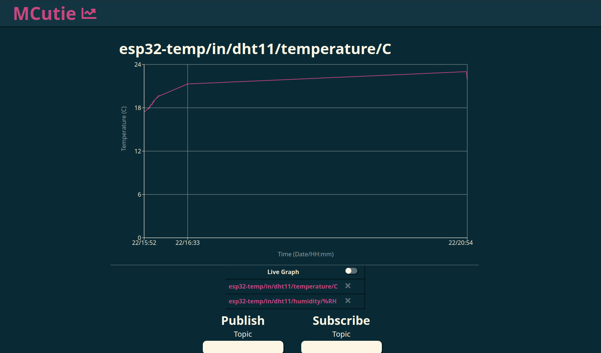

# Frontend

## Changing Colors
Most components are colored by `src/css/stylesheet.css`. 
Chart colors are defined in `src/util.js`. 
You can use another [base16](https://github.com/chriskempson/base16) color scheme or change the color codes to your liking. 
The default color scheme is based on [Solarized Dark](https://en.wikipedia.org/wiki/Solarized_(color_scheme)).

